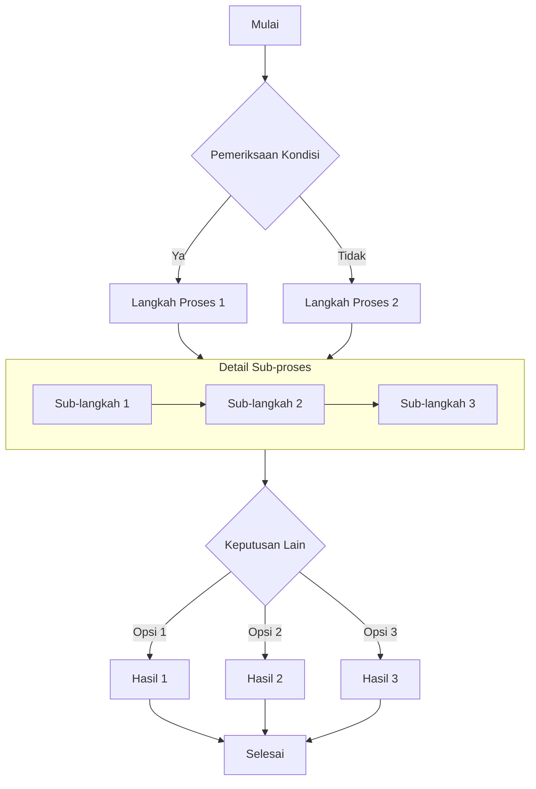
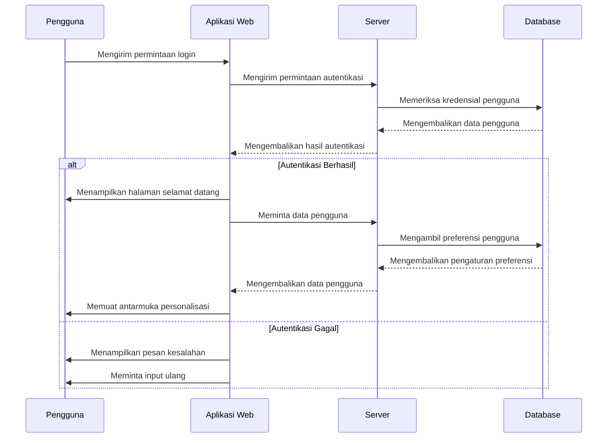
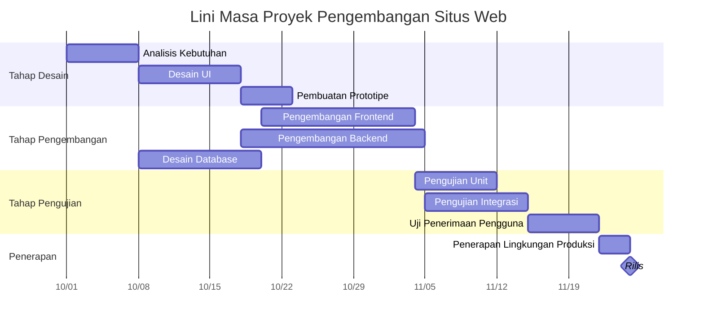
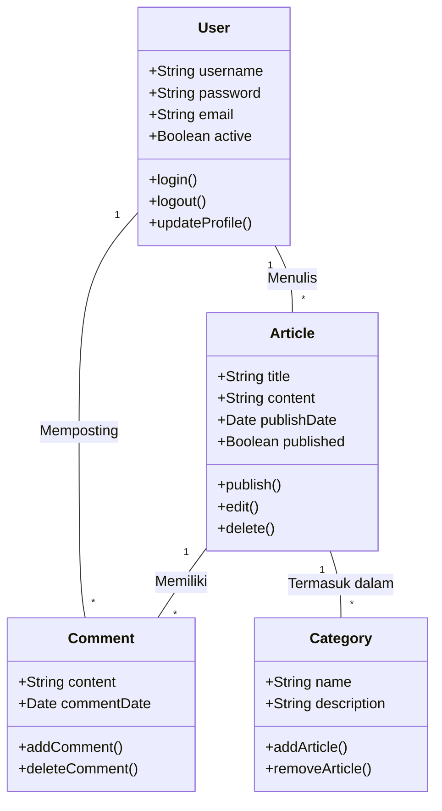
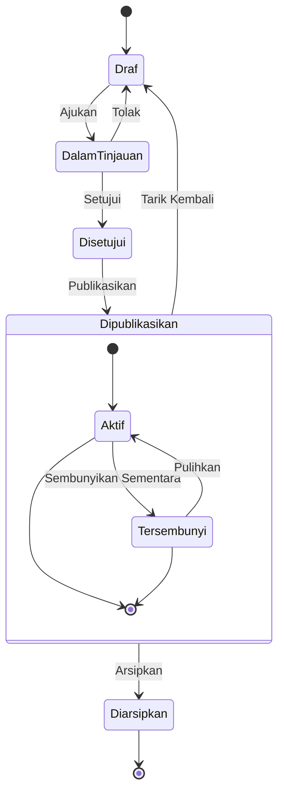
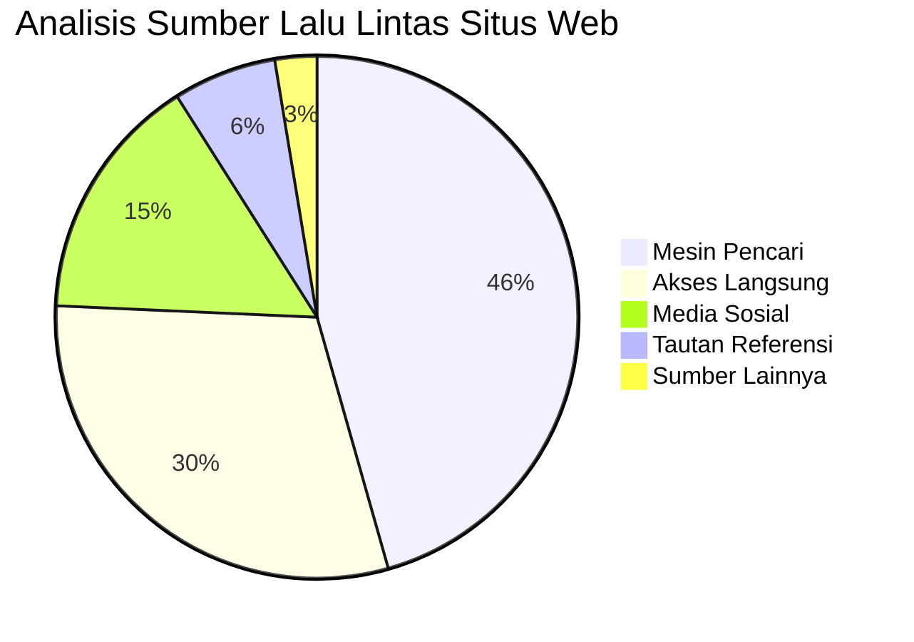

# Panduan Lengkap Diagram Mermaid di Markdown

Artikel ini mendemonstrasikan cara membuat berbagai diagram kompleks menggunakan Mermaid di dalam dokumen Markdown, termasuk diagram alir (flowchart), diagram urutan (sequence diagram), bagan Gantt, diagram kelas, dan diagram status.

## Contoh Diagram Alir (Flowchart)

Diagram alir sangat cocok untuk merepresentasikan alur proses atau langkah-langkah algoritma.



## Contoh Diagram Urutan (Sequence Diagram)

Diagram urutan menunjukkan interaksi antar objek seiring berjalannya waktu.



## Contoh Bagan Gantt (Gantt Chart)

Bagan Gantt sangat ideal untuk menampilkan kemajuan proyek dan lini masa (timeline).



## Contoh Diagram Kelas (Class Diagram)

Diagram kelas menunjukkan struktur statis sistem, termasuk kelas, atribut, metode, dan hubungannya.



## Contoh Diagram Status (State Diagram)

Diagram status menunjukkan urutan status yang dilalui objek selama siklus hidupnya.



## Contoh Diagram Lingkaran (Pie Chart)

Diagram lingkaran sangat cocok untuk menampilkan data proporsi dan persentase.



## Kesimpulan

Mermaid adalah alat yang ampuh untuk membuat berbagai jenis diagram di dalam dokumen Markdown. Artikel ini telah mendemonstrasikan penggunaan diagram alir, diagram urutan, bagan Gantt, diagram kelas, diagram status, dan diagram lingkaran. Diagram-diagram ini dapat membantu Anda mengekspresikan konsep, proses, dan struktur data yang kompleks dengan lebih jelas.

Untuk menggunakan Mermaid, cukup tentukan bahasa `mermaid` di dalam blok kode dan deskripsikan diagram menggunakan sintaks teks yang ringkas. Mermaid akan secara otomatis mengubah deskripsi tersebut menjadi diagram visual yang indah.

Cobalah gunakan diagram Mermaid di artikel blog teknis atau dokumentasi proyek Anda berikutnya - mereka akan membuat konten Anda lebih profesional dan lebih mudah dipahami!

```
